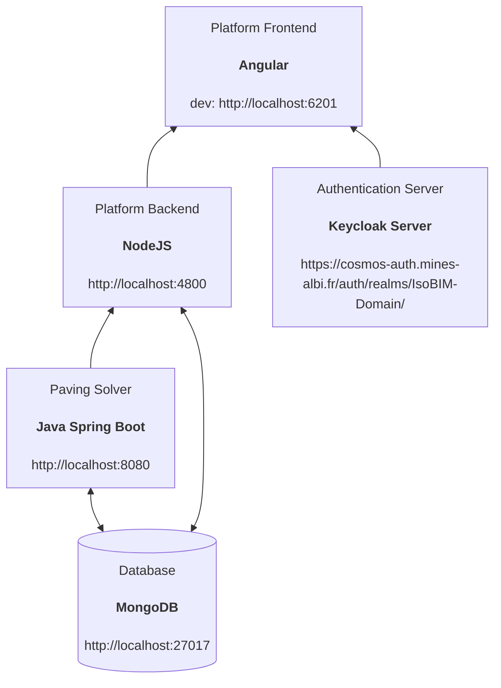

# ISOBIM Paving Prototype 

# Presentation

This prototype is a Web app allowing to pave buildings facades thanks
to rectangular panels that are generated on-the-fly according to some
constructive principles.

# Installation

## Prerequisites
- Mongodb exposing on localhost:27017
- JDK 17
- node >= 14.16.0
- Keyclaok Server with a configured IsoBIM-Domain


```json
    {
    "realm": "IsoBIM-Domain",
    "auth-server-url": "https://cosmos-auth.mines-albi.fr/auth",
    "ssl-required": "external",
    "resource": "isobim-paving-dashboard-client",
    "public-client": true,
    "confidential-port": 0
    }
```
---
## Example of configuration

- a client must be created, called `isobim-paving-dashboard-client` where the root URL must correspond to the deployed frontend URL.
  

## Architecture



ISOBIM prototype is made of 3 parts:
1. backend java in paving-solver folder
    - ./mvnw spring-boot:run with a JDK 17 installed
2. backend platform in backend folder
    - npm install
    - npm start (or node server.js)
3. GUI frontend in frontend folder
    - npm install --legacy-peer-deps
    - either build static files to be served by a http server such as apache or nginx (warning, the ip address is configured for the CGI labs server)
        - `node --max_old_space_size=2024 ./node_modules/@angular/cli/bin/ng build --configuration=preprod --project=isobim-paving-dashboard --base-href /isobim-paving-dashboard/`
        - local deployment (dev config working on localhost) : `npx nx build isobim-paving-dashboard`, then for example `python -m http.server 6201` in the dist/apps/isobim-paving-dashboard folder
    - either start a dev server 
        - nx serve --project=isobim-paving-dashboard --port=6201


# Usage

The JSON input of this app is defined here (TODO)
Here is an [example](/examples/example.json) of JSON file.

